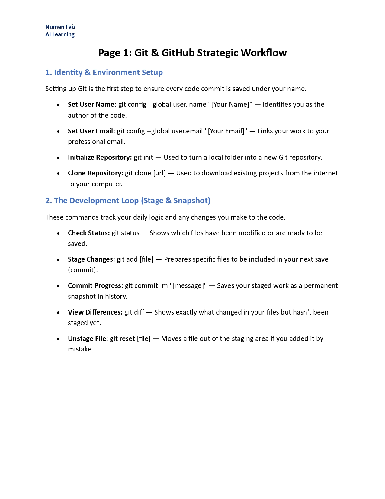
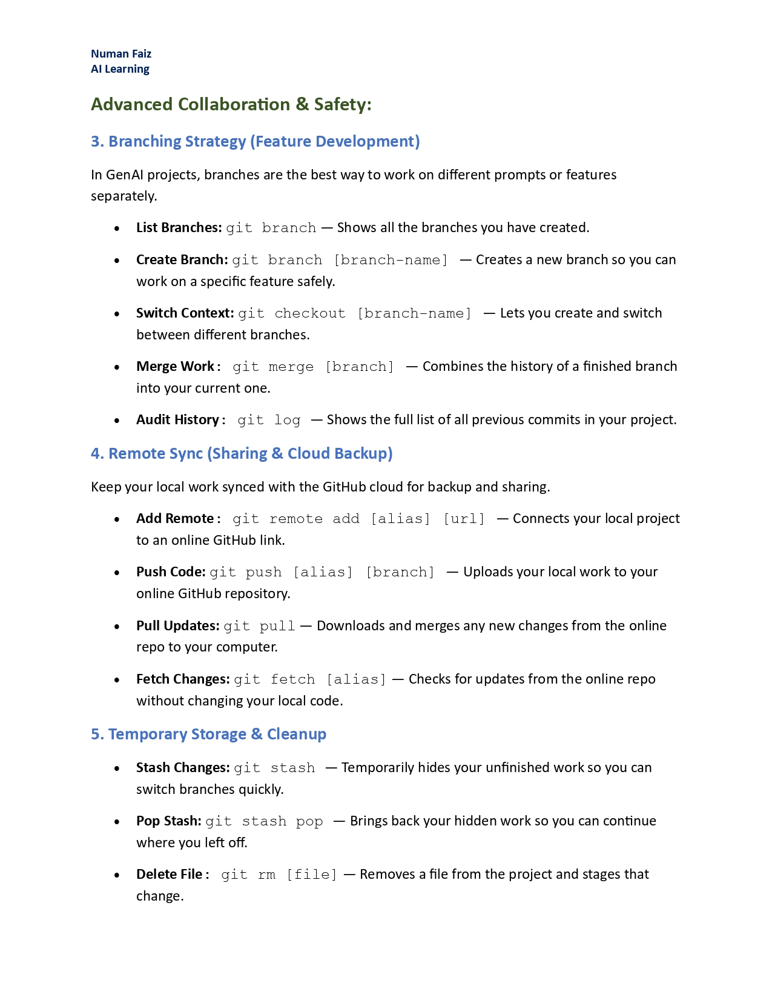

# Generative AI Learning Journey

This repository serves as a professional record of my technical progress and documentation as I transition into the field of Generative AI.

## Version Control Mastery: Git and GitHub
A strong foundation in version control is essential for scalable AI development. This section contains my strategic workflows, command references, and best practices for managing complex projects.

### Technical Workflow Documentation
The following snapshots provide a visual overview of my documented Git processes:

---
### Project Resources and Development Focus
*   **Complete Documentation:** [Download Strategic-Git-Workflow.pdf](./Git-and-GitHub/Git-Pro-Workflow-as.pdf)
*   **Current Objectives:** Actively mastering Generative AI architectures, specifically focusing on Large Language Models (LLMs), Transformers, and AI orchestration frameworks.
*   **Academic Background:** Software Engineering graduate with a focus on implementing production-ready technical solutions.

## Week 2: Strategic Prompt Engineering
Mastering the art of "Steering" Large Language Models (LLMs) to move from generic outputs to high-precision, technical results. This section documents the transition from simple chatting to Natural Language Programming.

### Core Techniques & Methodologies
* **Chain-of-Thought (CoT):** Implementing step-by-step reasoning to eliminate logical and arithmetic errors.
* **Few-Shot Prompting:** Utilizing Input-Output patterns to automate complex formatting and classification.
* **Interview-Style Prompting:** Designing interactive prompts where the model extracts context before execution.
* **Technical Constraints:** Managing System vs. User prompts, Temperature settings, and Token efficiency.

### Technical Artifacts
* **Full Documentation:** [Download Prompt-Engineering-Masterclass.pdf](./Prompt-Engineering/Prompt-Engineering-Presentation.pdf)
* **Prompt Library:** [View Detailed Prompt Examples](./Prompt-Engineering/technical-prompts.md)

---
## 🐍 Next Milestone: Python for Data Science
Now that the foundation of AI communication is set, I am pivoting back to the code.
* **Objective:** Mastering NumPy, Pandas, Matplotlib, and Seaborn.
* **Goal:** Bridging the gap between LLM steering and production-ready data analysis.
